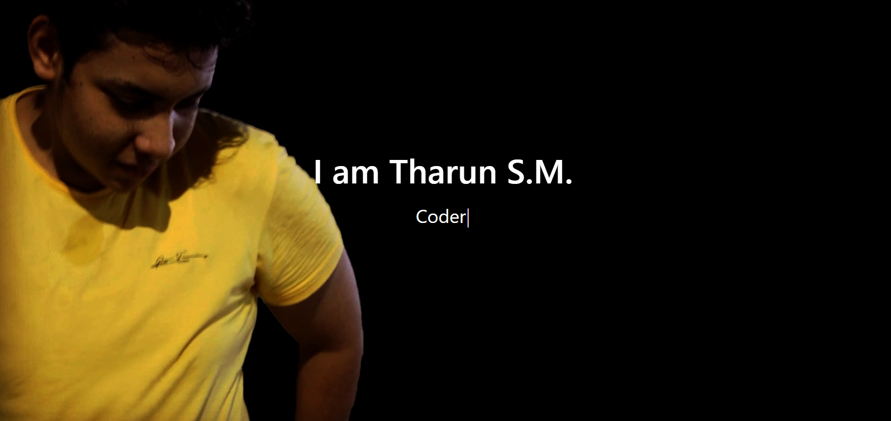

### Welcome to Tharun S.M. Github-Profile    </a>
<i>View my</i>
  <a href="https://drive.google.com/file/d/1tMQfiOBcTPmaYyyOtiURxuG8TJNumEzS/view?usp=sharing">
    <i>Resume</i>
  </a>

### Skills 👨‍💻

### Languages

 

### Software Development and Other Technology

 

### Cloud&DB

 

### UX/UI Designing

 
 
<i>Note: The above are the skills im interested in , doesnt mean im a expert in it </i>

### Contact Me 👇

  
  
    
  
  

